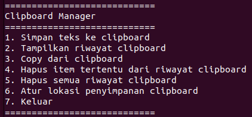

# Data Diri

|  |  |
|--|--|
| NIM | **2341720080** |
| Nama Lengkap | **Ahmad Naufal Waskito Aji** |
| Kelas | TI-1B |
| Dosen Pengampu | Erfan Rohadi, ST., M.Eng., Ph.D. |
|  | Mohammad Faried Rahmat, S.ST., M.Tr.T |

# SISTEM OPERASI
### Fitur
|  |  |  |
|--|--|--|
|**No**| **Fitur** | **Detail** |
| 1 | Simpan teks ke clipboard | Menggunakan xclip |
| 2 | Menampilkan riwayat clipboard | Mencetak menggunakan cat |
| 3 | Copy dari clipboard | - |
| 4 | Hapus riwayat tertentu | Memilih item tertentu dari riwayat clipboard |
| 5 | Hapus semua riwayat | Mengosongkan clipboard |
| 6 | Atur lokasi clipboardd | Mengubah lokasi clipboard |

# SCREENSHOT PROGRAM

| ?? - Program Shell - UAS Praktikum Sistem Operasi |
